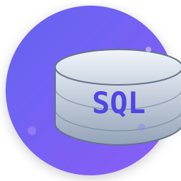
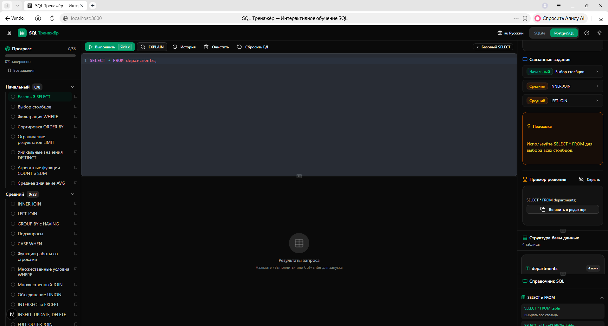

# SQL Trainer

<p align="center">
  
</p>

<p align="center">
  <strong>Интерактивный тренажер SQL для изучения и практики</strong>
</p>

<p align="center">
  <a href="#features">Features</a> •
  <a href="#quick-start">Quick Start</a> •
  <a href="#tech-stack">Tech Stack</a>
</p>

---

## Interface

<table>
  <tr>
    <td align="center"><a href="img/Главная страница.png"></a><br/><sub>Главная страница</sub></td>
    <td align="center"><a href="img/Задания.png"></a><br/><sub>Режим заданий</sub></td>
  </tr>
  <tr>
    <td align="center"><a href="img/Горячие клавиши.png"></a><br/><sub>Горячие клавиши</sub></td>
    <td align="center"><a href="img/Свободный режим.png"></a><br/><sub>Свободный режим</sub></td>
  </tr>
  <tr>
    <td align="center"><a href="img/Несколько тем оформления и шаблоны.png"></a><br/><sub>Темы и шаблоны</sub></td>
    <td align="center"><a href="img/Экспорт - импорт.png"></a><br/><sub>Экспорт / Импорт</sub></td>
  </tr>
</table>

## Features

- **Обучающие задания** — практические задачи по SQL с автоматической проверкой
- **Свободный режим** — пишите любые запросы и исследуйте базу данных
- **Поддержка SQLite и PostgreSQL** — работайте с разными СУБД
- **SQL-редактор** — подсветка синтаксиса, автодополнение, горячие клавиши
- **Темы оформления** — светлая, темная и другие темы
- **История запросов** — сохраняйте и возвращайтесь к предыдущим запросам
- **Экспорт/Импорт** — делитесь результатами в CSV и других форматах
- **Система прогресса** — отслеживайте достижения и серию занятий
- **Рекомендации** — персонализированные sugestions для улучшения навыков
- **Аутентификация** — сохраняйте прогресс и соревнуйтесь с другими

## Quick Start

```bash
# Установка зависимостей
npm install

# Запуск в режиме разработки
npm run dev

# Сборка для продакшена
npm run build
```

Откройте [http://localhost:3000](http://localhost:3000) в браузере.

## Tech Stack

- [Next.js 16](https://nextjs.org/) — React-фреймворк
- [CodeMirror 6](https://codemirror.net/) — SQL-редактор
- [shadcn/ui](https://ui.shadcn.com/) — компоненты интерфейса
- [Better SQLite3](https://github.com/WiseLibs/better-sqlite3) / PostgreSQL — базы данных
- [NextAuth.js](https://next-auth.js.org/) — аутентификация
- [Zustand](https://github.com/pmndrs/zustand) — управление состоянием
- [Recharts](https://recharts.org/) — графики и визуализация
- [Tailwind CSS 4](https://tailwindcss.com/) — стилизация
